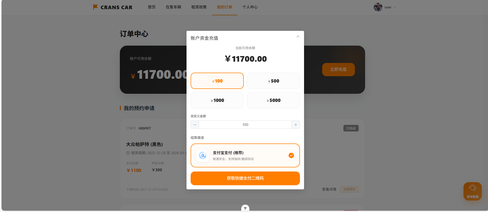
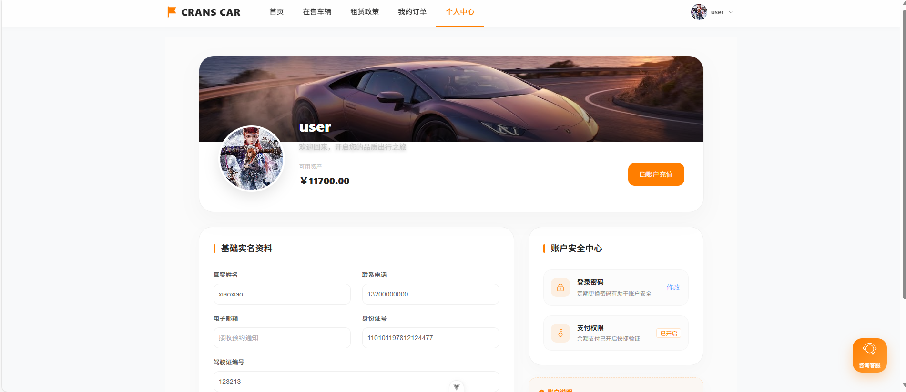
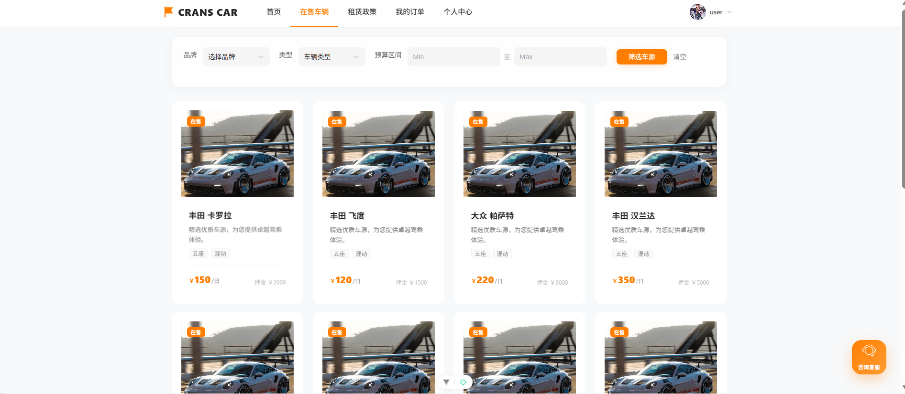
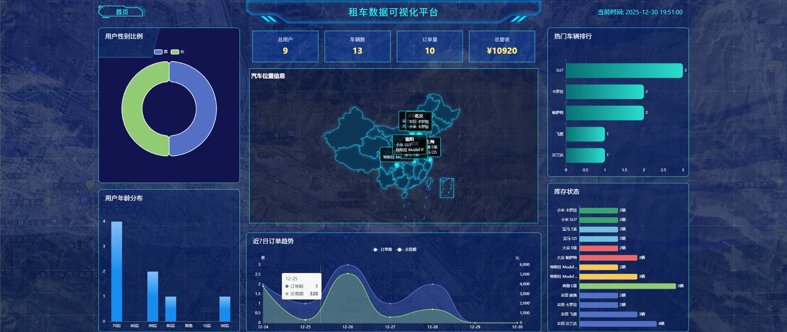
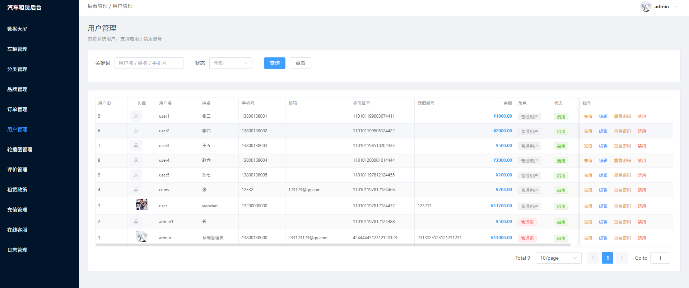
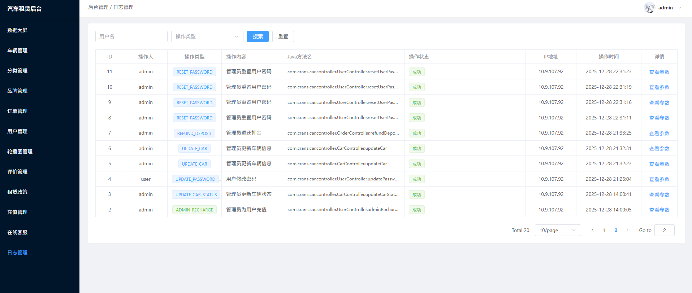

# car汽车租赁管理系统

wx:`CransX811211`

qq:`3639875308`

基于springboot的汽车租赁管理系统

系统功能特性：

- 用户功能 ：注册登录、车辆浏览搜索、在线预订、订单管理、支付功能（支付宝扫码）、评价系统、个人信息管理
- 管理员功能 ：车辆管理、分类管理、订单管理、用户管理、日志管理、客服系统
- 特色功能 ：余额充值系统、数据大屏展示、实时聊天客服、操作日志记录
技术栈分析：

- 后端 ：Spring Boot 3.1.0 + MyBatis Plus + MySQL 8.0 + JWT认证
- 前端 ：Vue 3.5 + Vite + Pinia状态管理 + Element Plus UI
- 额外技术 ：WebSocket实时通信、ECharts数据可视化、支付宝支付集成
运行环境要求：

- JDK 17+ 用于后端Spring Boot应用
- Maven 3.6+ 用于项目构建
- Node.js 20.19.0+ 用于前端开发
- MySQL 8.0+ 数据库服务

系统截图

wx:`CransX811211`

qq:`3639875308`
